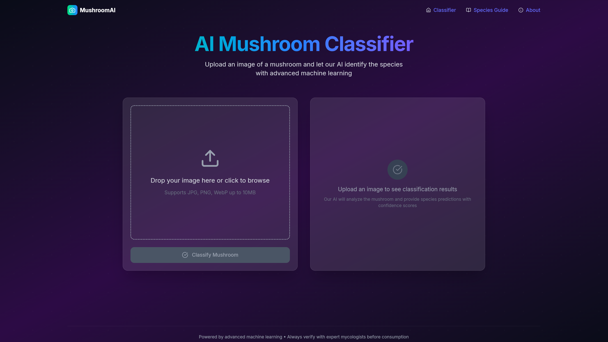
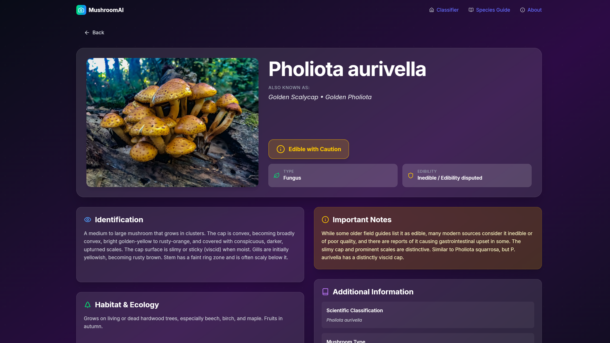

# AI Mushroom Classifier 🍄

An intelligent web application that identifies mushroom species from uploaded images using a custom-trained deep learning model. Users receive real-time predictions with confidence scores, aiding in the preliminary identification of mushrooms.



## Table of Contents

-   [Overview](#overview)
-   [Features](#-features)
-   [Technologies Used](#️-technologies-used)
-   [Model Training & Performance](#-model-training--performance)
-   [Screenshots (Placeholder)](#️-screenshots-placeholder)
-   [System Architecture](#️-system-architecture)
-   [Local Setup & Installation](#-local-setup--installation)
    -   [Prerequisites](#prerequisites)
    -   [1. Clone Repository](#1-clone-repository)
    -   [2. Backend Setup (Flask & AI Model)](#2-backend-setup-flask--ai-model)
    -   [3. Frontend Setup (React)](#3-frontend-setup-react)
    -   [4. Running the Application](#4-running-the-application)
-   [Project Structure](#-project-structure)
-   [Future Enhancements](#-future-enhancements)
-   [Contact](#contact)

## Overview

The AI Mushroom Classifier is a full-stack application designed to make mushroom identification more accessible. It combines a user-friendly React frontend with a powerful Flask backend that serves predictions from a TensorFlow/Keras Convolutional Neural Network (CNN). This tool aims to provide quick, AI-driven insights into 100 different mushroom species based on visual data.

## 🚀 Live Demo

Check out the deployed AI Mushroom Classifier app here:  
[https://ai-mushroom-classifier-r2ed.vercel.app/](https://ai-mushroom-classifier-r2ed.vercel.app/)

## ✨ Features

-   **Image Upload:** Intuitive interface for uploading mushroom images (supports drag-and-drop and file browser).
-   **Real-time Classification:** Swift predictions served from the backend AI model.
-   **Multiple Predictions:** Displays the top 3 likely mushroom species with corresponding confidence scores.
-   **Confidence Warnings:** Indicates when prediction confidence is low, advising caution.
-  **Species Information Pages:** Browse a list of all 100 classifiable mushroom species with dedicated pages for details
-   **Responsive Design:** User interface styled with Tailwind CSS for usability across different screen sizes.


## 🛠️ Technologies Used

-   **Frontend:**
    -   React
    -   Tailwind CSS
    -   Lucide React (for icons)
-   **Backend:**
    -   Python (3.9+ recommended, developed with 3.12.10)
    -   Flask
    -   Flask-CORS (for handling cross-origin requests)
-   **Machine Learning & Image Processing:**
    -   TensorFlow 2.19.0
    -   Pandas 
    -   Matplotlib
    -   NumPy
    -   Pillow (PIL)
-   **Development Tools:**
    -   Git & GitHub (Version Control)
    -   VS Code (or preferred IDE)
    -   Jupyter
    -   Standard command-line tools

## 🧠 Model Training & Performance

The core of this application is a Convolutional Neural Network (CNN) trained for image classification:

-   **Model Architecture:** Built using TensorFlow/Keras, leveraging transfer learning with MobileNetV2 as the base model, followed by custom layers (GlobalAveragePooling2D, BatchNormalization, Dense, Dropout).
-   **Dataset:** Trained on a dataset of mushroom images covering **100 different species**. (https://www.kaggle.com/datasets/thehir0/mushroom-species/code)
-   **Training Techniques:**
    -   Data Augmentation (RandomFlip, RandomRotation, RandomZoom) to improve model generalization.
    -   Callbacks like `EarlyStopping`, `ReduceLROnPlateau`, and `ModelCheckpoint` were used for efficient training.
    -   Fine-tuning of the later layers of the pre-trained MobileNetV2.
-   **Performance:** Achieved approximately **80% accuracy** on the test set for classifying 100 distinct mushroom species.

## 🖼️ Screenshots

  
  
  

## ⚙️ System Architecture

The application follows a client-server architecture:

1.  **React Frontend:** Handles user interactions, image uploads, and presentation of results.
2.  **Flask Backend API:**
    -   Receives image data from the frontend.
    -   Preprocesses the image (resize, normalize) using Pillow and NumPy.
    -   Feeds the processed image to the loaded TensorFlow/Keras model.
    -   Returns the top N predictions (label, confidence) as a JSON response.
3.  **TensorFlow/Keras Model:** The pre-trained `.keras` file containing the learned weights for mushroom classification.

## 🚀 Local Setup & Installation

Follow these instructions to get the project running on your local machine.

### Prerequisites

-   Python (3.12.10 recommended, or a compatible 3.x version)
-   pip 
-   Node.js
-   npm (or yarn)

### 1. Clone Repository

Execute the following command in your terminal:

```bash
git clone https://github.com/devanshkp/ai-mushroom-classifier
```

### 2. Backend Setup (Flask & AI Model)

1.  **Navigate to the backend directory:**

    Execute the following command in your terminal:
    ```bash
    cd backend
    ```

2.  **Create and activate a virtual environment (recommended):**

    Execute the following commands in your terminal:

    ```bash
    python -m venv venv

    # Windows
    venv\Scripts\activate

    # macOS/Linux
    source venv/bin/activate
    ```

3.  **Install Python dependencies:**
    Once the virtual environment has been activated, run the following command in your terminal:

    ```bash
    pip install -r requirements.txt
    ```

4.  **Place Model and Class Names:**
    -   Ensure your trained model file (e.g., `mushroom.keras`) is placed inside the `model` sub-directory within the `backend` folder: `backend/model/mushroom.keras`.
    -   Ensure your `class_names.json` file is placed directly inside the `backend` folder: `backend/class_names.json`.
    -   **Important:** Your Flask `app.py` code should reference these files with paths relative to `app.py`. For example, if `app.py` is in the `backend` folder:

        ```python
        # In backend/app.py
        with open('class_names.json', 'r') as f: # Correct relative path
            class_names = json.load(f)
        model = keras.models.load_model('model/mushroom.keras') # Correct relative path
        ```

5.  **Run the Flask backend server:**

    Run `app.py` python file.

    The backend should now be running, by default on `http://localhost:5000` unless changed.

### 3. Frontend Setup (React)

1.  **Navigate to the frontend directory (from the project root):**

    Execute the following command in your terminal:

    ```bash
    cd frontend
    ```

2.  **Install Node.js dependencies:**

    Execute the following command in your terminal:
    
    ```bash
    npm install
    ```

    *(Or `yarn install` if you are using Yarn)*

3.  **Verify API Endpoint:**
    Ensure the `Workspace` URL in your React component (e.g., `src/Home.js` or `src/App.js`) points to your local Flask backend:
    ```javascript
    // For example in Home.jsx
    const res = await fetch("http://localhost:5000/predict", { /* ... */ });
    ```

4.  **Run the React frontend development server:**

    Execute the following command in your terminal:

    ```bash
    npm run dev
    ```

    *(Or `yarn dev` if you are using Yarn)*

    The frontend should now open in your browser at `http://localhost:5173/`.

### 4. Running the Application

-   Once both backend and frontend servers are running, open your browser and navigate to the react app URL.
-   You should be able to upload an image and see the classification results.

## 📁 Project Structure

A high-level overview of the project directory structure:


```text
ai-mushroom-classifier/
├── backend/
│   ├── app.py                            # Main Flask application
│   ├── requirements.txt                  # Python dependencies
│   ├── notebook/
│   │   └── mushroom_classification.ipynb # Scripts used for model training
│   ├── model/
│   │   └── mushroom.keras                # Trained Keras model file
│   ├── class_names.json                  # JSON file mapping indices to species names
│   └── venv/                             # Python virtual environment (if created)
│
├── frontend/
│   ├── public/                           # Static assets
│   ├── src/
│   │   ├── main.jsx                      # Main JavaScript entry point
│   │   ├── App.jsx                       # Root React application component
│   │   ├── index.css                     # Global styles
│   │   └── pages/                        # Page components
│   │       ├── Home.jsx                  # Home page containing the core classifier
│   │       ├── SpeciesList.jsx           # Lists all classifiable species
│   │       └── Species.jsx               # Details for an individual species
│   ├── index.html                        # Main HTML entry point for Vite
│   ├── vite.config.js                    # Vite configuration
│   └── package.json                      # Node.js dependencies and scripts
│
│
└── README.md                             # This file                          
```

## 💡 Future Enhancements

-   Cache upload/classifcation history using cookies.
-   Option to provide feedback on predictions to improve the model over time.
-   Batch image uploads for multiple classifications.

## Contact

Connect on [LinkedIn](https://linkedin.com/in/devansh-kapoor) <br>
Reach out via Email: `devansh.kp@outlook.com`
